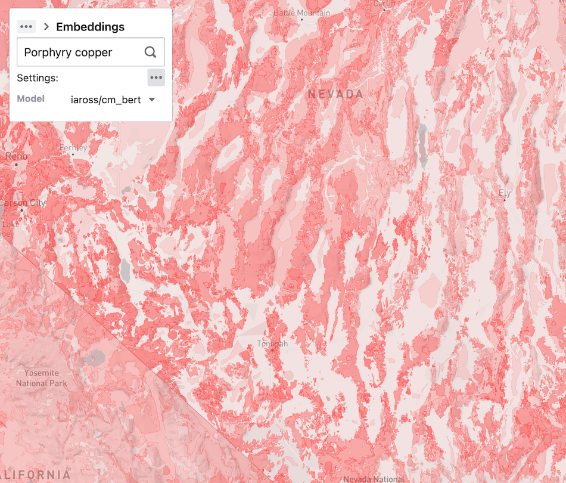

# Macrostrat polygon embeddings tile server

A prototype tile server that adds a `similarity` field to Macrostrat tiles based on legend text similarity
with an search term.

Matching is done with SBERT embedding models. It is possible to use either an out-of-the-box model or a custom model trained on mining reports.

This work was done as part of the the [DARPA CriticalMAAS](https://github.com/DARPA-CRITICALMAAS/) program. This
proof-of-concept
could be applied to CDR tile layers as well.

- [Initial modeling](https://github.com/DARPA-CRITICALMAAS/sri-ta2-mappable-criteria/blob/main/polygon_ranking/notebooks/macrostrat.ipynb)
  by **Meng Ye** at SRI.
- xDD embedding model was trained by Ian Ross.

